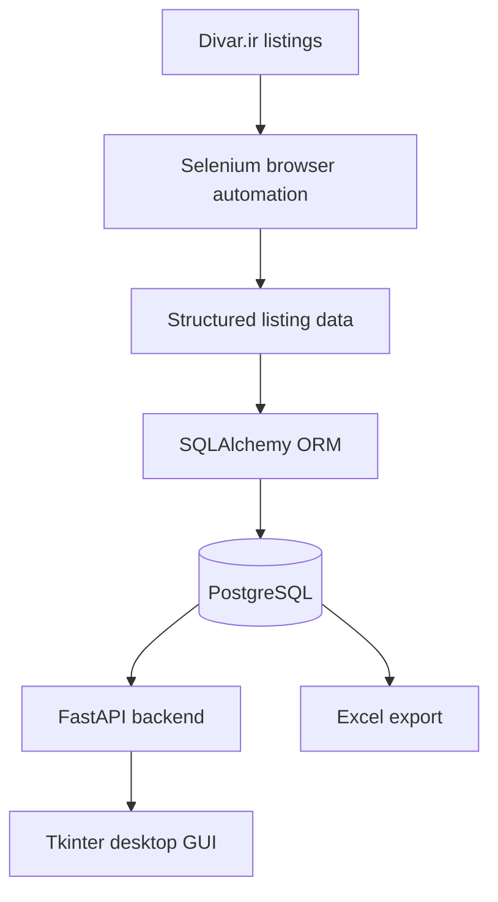

# Divar-Scraper

A modular Python application that automates the collection of real-estate listing data, stores it in a PostgreSQL database, exposes it through a FastAPI backend, and provides a Tkinter desktop client for browsing that data. Excel export is available as an additional output path. The project was built as a CS50x final project to explore an end-to-end data pipeline, from browser automation through relational storage to an API-backed desktop UI.

## Overview

Divar-Scraper targets real-estate listings on Divar.ir, Iran's largest classifieds platform, and turns them into structured records — title, price, size, room count, floor, location, amenities, description, images, and the source link. Those records are persisted to PostgreSQL through SQLAlchemy, served over a small REST API built with FastAPI, and made browsable through a Tkinter desktop application. A separate export path can produce an Excel workbook of the stored listings.

The public repository does not contain real scraped data. The sample workbook at `docs/sample_ads.xlsx` is entirely synthetic — see [Sample Data](#docs\sample_ads.xlsx).

## Project Goals

This project was built to work through a full data pipeline in one place:

- browser automation against a real, dynamic website using Selenium
- turning semi-structured listing pages into a consistent record schema
- relational modeling and persistence with SQLAlchemy and PostgreSQL
- a REST API layer with FastAPI, including automatic interactive documentation
- a desktop client (Tkinter) that consumes that API over HTTP
- exporting structured data to Excel for offline use

The goal was to connect these pieces — scraping, storage, an API, and a desktop client — into one working pipeline rather than treating each as an isolated exercise. It is a learning and portfolio project, not a deployed or commercially operated service.

## Architecture



The scraper (`scraper/scraper.py`) is responsible for navigating listing pages and extracting the fields above. The data layer (`core/database.py`) defines the SQLAlchemy model and manages the PostgreSQL connection. The API (`api/main.py`, `api/ads.py`) exposes that data over HTTP, and the GUI (`gui/app.py`) consumes the API for the desktop experience. Exact internals — parsing approach, session handling, request/response models — live in those source files; this document describes the pipeline's shape rather than restating implementation details it can't directly verify.

## How It Works

```text
Crawling  →  Extraction  →  Structuring  →  Database storage  →  API  →  Desktop client
```

The scraper visits listing pages, extracts the relevant fields, and writes structured records to PostgreSQL via SQLAlchemy. The FastAPI backend reads from that same database and serves it as JSON. The Tkinter GUI calls the API to display listings to the user. Excel export reads from the stored data (or, for the public sample, from a synthetic dataset) and writes a formatted workbook.

## Features

- **Scraping** — browser automation with Selenium to collect real-estate listing fields from Divar.ir.
- **Database** — a SQLAlchemy ORM model persisted to PostgreSQL.
- **API** — a FastAPI backend exposing listing data as JSON, with interactive API documentation.
- **Desktop GUI** — a Tkinter client that requests data from the API and displays it to the user.
- **Excel export** — writes listing data to a formatted `.xlsx` workbook.

## Tech Stack

| Technology | Role |
|---|---|
| Python | Core language |
| Selenium | Browser automation for scraping |
| SQLAlchemy | ORM / database access |
| PostgreSQL | Persistent storage |
| FastAPI | REST API layer |
| Tkinter | Desktop GUI |
| Pandas / OpenPyXL | Data handling and Excel generation |
| python-dotenv | Loading configuration from `.env` |

Exact, pinned dependency versions are defined in `requirements.txt`.

## Project Structure

```text
Divar-Scraper/
├── api/
│   ├── ads.py
│   ├── main.py
│   └── __init__.py
├── asset/
│   └── logo.ico
├── core/
│   ├── database.py
│   └── __init__.py
├── docs/
│   └── sample_ads.xlsx
├── gui/
│   ├── app.py
│   └── __init__.py
├── scraper/
│   ├── scraper.py
│   └── __init__.py
├── .env.example
├── .gitignore
├── requirements.txt
└── README.md
```

`.env` holds local database credentials and is not committed; `.env.example` is the safe, public template.

## Data Model

Listings are modeled with the following fields:

| Field | Type | Description |
|---|---|---|
| `id` | Integer | Primary key |
| `title` | String | Listing title |
| `date` | String | Publication date |
| `meter` | String | Property size (m²) |
| `year` | String | Construction year |
| `room` | String | Number of rooms |
| `total_price` | String | Total listed price |
| `meter_price` | String | Price per square meter |
| `floor` | String | Floor number |
| `amenities` | Text | Listed amenities |
| `description` | Text | Full listing description |
| `location` | String | Neighborhood / area |
| `images` | Text | Image URL(s) |
| `link` | String | Source URL of the listing |

This schema matches the fields used consistently throughout the project, including the sample export. The listing URL (`link`) is intended as the basis for de-duplicating listings from the same source; the exact column constraints (nullable, unique, indexed) are defined in `core/database.py`.

## API

Based on the project's design, the API exposes:

| Method | Endpoint | Purpose |
|---|---|---|
| GET | `/ads/` | Retrieve listings |
| GET | `/ads/{id}` | Retrieve a single listing by ID |

Exact route behavior is defined in `api/main.py` and `api/ads.py`. FastAPI generates interactive documentation automatically — by default, Swagger UI at `/docs` and ReDoc at `/redoc` — when the app runs with its default configuration. These are FastAPI's own generated documentation interfaces, not custom project pages.

## Desktop GUI

The Tkinter application (`gui/app.py`) is a thin client over the API: it sends HTTP requests to the FastAPI backend and displays the returned listing data.

```text
Tkinter GUI → HTTP request → FastAPI → PostgreSQL
```

## Sample Data

`docs/sample_ads.xlsx` contains synthetic demonstration data only. It contains no real Divar listings and no real personal information, and it is not intended to represent actual Iranian real-estate market statistics — it exists solely to demonstrate the shape of the data model and the exported Excel structure.

## Requirements

- **Python 3.8+**
- **PostgreSQL**, running and accessible
- A **Selenium-supported browser** such as Google Chrome
- **Selenium WebDriver** support; modern Selenium releases (4.6+) include Selenium Manager, which can automatically manage compatible drivers in many environments
- Python dependencies listed in `requirements.txt`

## Installation

```powershell
git clone https://github.com/AAM-Machine/Divar-Scraper.git
cd Divar-Scraper
python -m venv .venv
.venv\Scripts\Activate.ps1
pip install -r requirements.txt
```

## Configuration

Create a `.env` file (not committed) based on `.env.example`:

```env
DB_USER=your_username
DB_PASS=your_password
DB_HOST=localhost
DB_PORT=5432
DB_NAME=your_database
```

Create the target PostgreSQL database beforehand and make sure the server is running before starting the API or scraper.

## Limitations

- Divar's page structure can change, requiring scraper maintenance.
- Dynamically loaded content may occasionally lead to incomplete field extraction.
- Selenium requires a compatible browser on the host machine.
- The project depends on a running, reachable PostgreSQL instance.
- Configuration is local (`.env`) rather than centrally managed.

## Responsible Use

This tool is intended to be used responsibly:

- respect the source website's terms of service and applicable law
- scrape at a reasonable rate and avoid unnecessary load on the source site
- avoid collecting or publishing personal or sensitive information beyond what a listing itself contains publicly
- keep database credentials and any `.env` file private

This project does not implement, and this documentation does not describe, any method for bypassing CAPTCHAs, anti-bot protections, or rate limiting.

## Future Improvements

**Potential improvements** (not yet implemented):

- automated tests and CI
- Docker-based setup
- multi-city / multi-category scraping
- scheduled/background scraping
- richer search and filtering in the GUI and API

## Academic Context

This project was developed as a final project for CS50x. No AI-assisted coding tools were used during its development.

## Author

**AAM / Amirali Masoumi**
GitHub: [https://github.com/AAM-Machine](https://github.com/AAM-Machine)

## License

No license has been specified for this repository yet.
