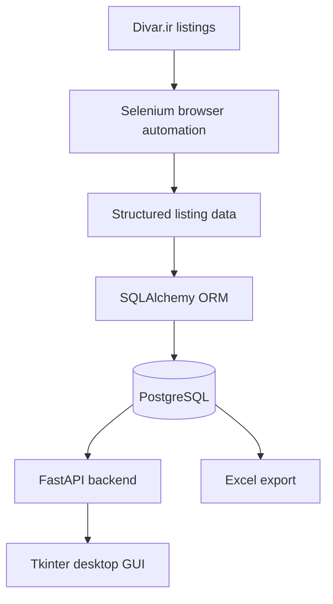

# Divar-Scraper

A modular Python application that explores an end-to-end real-estate data pipeline: browser automation, structured data extraction, PostgreSQL storage, a REST API, a desktop client, and Excel export.

This project was developed as a **CS50x Final Project** with the goal of connecting multiple parts of a real application into a single working data pipeline.

## Overview

**Divar-Scraper** targets real-estate listings on **Divar.ir**, Iran's classifieds platform, and transforms listing information into structured records such as:

* title
* price
* property size
* room count
* floor
* location
* amenities
* description
* image URLs
* source listing URL

The extracted records are stored in **PostgreSQL** through **SQLAlchemy**, exposed through a **FastAPI** backend, and consumed by a **Tkinter** desktop application.

The project also supports exporting collected data to Excel.

The public repository does **not** contain real scraped listings. The file `docs/sample_ads.xlsx` contains synthetic demonstration data only.

## Why This Project Exists

The project was built to connect several parts of a real application — web scraping, relational storage, an API, and a desktop client — into one working pipeline rather than studying each topic in isolation.

The goal was to understand how data can move from a live webpage to structured records, from structured records to a database, from a database to an API, and finally from an API to a user-facing application.

This is a **learning and portfolio project**, not a deployed or commercially operated scraping service.

## Architecture



The main components are:

* **Scraper** — collects and structures listing data.
* **Database layer** — stores listings in PostgreSQL through SQLAlchemy.
* **FastAPI backend** — exposes stored listings through HTTP endpoints.
* **Tkinter GUI** — provides a desktop interface for browsing and retrieving listings.
* **Excel export** — produces `.xlsx` output from collected data.

## Application Preview

### Main Window

The main desktop interface provides direct access to listing search,
stored listings, and the scraping workflow.


### Stored Listings

Collected listings can be browsed through a dedicated table showing
their ID, title, and location. Double-clicking a listing opens its
detailed view.


### Listing Details

Individual listings can be retrieved by ID and displayed with their
property information, pricing, amenities, description, and source URL.


## How It Works

```text
Crawling
   ↓
Extraction
   ↓
Structuring
   ↓
PostgreSQL Storage
   ↓
FastAPI
   ↓
Tkinter Desktop Client
```

The scraper uses Selenium to interact with the website and extract listing information. The resulting records are stored directly in PostgreSQL through SQLAlchemy.

The FastAPI application reads the stored records and exposes them as JSON. The Tkinter application communicates with that API over HTTP and presents the information through a desktop interface.

Excel export provides an additional way to work with the collected records outside the application.

## Features

* **Web scraping** with Selenium
* **HTML parsing** with BeautifulSoup
* **Structured PostgreSQL storage**
* **SQLAlchemy ORM-based data access**
* **REST API** built with FastAPI
* **Pydantic-based API data models**
* **Automatic Swagger / OpenAPI documentation**
* **Tkinter desktop client**
* **Listing lookup by ID**
* **Duplicate listing prevention based on listing URL**
* **Excel export**
* **Synthetic public sample dataset**
* **Environment-based database configuration**

## Tech Stack

| Technology        | Role                                     |
| ----------------- | ---------------------------------------- |
| **Python**        | Core programming language                |
| **Selenium**      | Browser automation                       |
| **BeautifulSoup** | HTML parsing                             |
| **SQLAlchemy**    | ORM and database access                  |
| **PostgreSQL**    | Persistent data storage                  |
| **FastAPI**       | REST API layer                           |
| **Pydantic**      | API data validation and serialization    |
| **Tkinter**       | Desktop GUI                              |
| **Requests**      | HTTP communication from the GUI          |
| **Pandas**        | Data processing and Excel export         |
| **OpenPyXL**      | Excel workbook generation and formatting |
| **python-dotenv** | Environment configuration                |
| **Uvicorn**       | FastAPI application server               |
| **Psycopg**       | PostgreSQL DBAPI driver                  |

Project dependencies are listed in `requirements.txt`.

## Project Structure

```text
Divar-Scraper/
├── api/
│   ├── ads.py
│   ├── main.py
│   └── __init__.py
│
├── asset/
│   └── logo.ico
│
├── core/
│   ├── database.py
│   └── __init__.py
│
├── docs/
│   └── sample_ads.xlsx
│
├── gui/
│   ├── app.py
│   └── __init__.py
│
├── scraper/
│   ├── scraper.py
│   └── __init__.py
│
├── .env.example
├── .gitignore
├── requirements.txt
└── README.md
```

### Main Components

| Path                 | Responsibility                                                                         |
| -------------------- | -------------------------------------------------------------------------------------- |
| `scraper/scraper.py` | Web crawling, extraction, database storage, and Excel export                           |
| `core/database.py`   | SQLAlchemy model, PostgreSQL connection, session handling, and database initialization |
| `api/main.py`        | FastAPI application entry point and application initialization                         |
| `api/ads.py`         | Advertisement API routes and response models                                           |
| `gui/app.py`         | Tkinter desktop interface and API communication                                        |
| `asset/`             | Application assets                                                                     |
| `docs/`              | Public documentation and synthetic sample output                                       |

The real `.env` file is kept locally and excluded from version control. `.env.example` provides the public configuration template.

## Data Model

Listings are represented using the following fields:

| Field         | Type    | Description                    |
| ------------- | ------- | ------------------------------ |
| `id`          | Integer | Primary key                    |
| `title`       | String  | Listing title                  |
| `date`        | String  | Publication date               |
| `meter`       | String  | Property size in square meters |
| `year`        | String  | Construction year              |
| `room`        | String  | Number of rooms                |
| `total_price` | String  | Total listed price             |
| `meter_price` | String  | Price per square meter         |
| `floor`       | String  | Floor number                   |
| `amenities`   | Text    | Property amenities             |
| `description` | Text    | Full listing description       |
| `location`    | String  | Neighborhood or area           |
| `images`      | Text    | Image URL data                 |
| `link`        | String  | Original listing URL           |

The listing URL is used as the basis for source-level duplicate prevention. The implementation also defines database-level uniqueness constraints for the `link` field.

## API

The FastAPI backend exposes listing data through REST endpoints.

| Method | Endpoint       | Purpose                       |
| ------ | -------------- | ----------------------------- |
| `GET`  | `/ads/`        | Return stored listings        |
| `GET`  | `/ads/{ad_id}` | Return a single listing by ID |

When a requested listing ID does not exist, the API returns an appropriate `404` response.

FastAPI automatically provides interactive API documentation using its default documentation interfaces:

* **Swagger UI:** `http://127.0.0.1:8000/docs`
* **ReDoc:** `http://127.0.0.1:8000/redoc`
* **OpenAPI schema:** `http://127.0.0.1:8000/openapi.json`

These are generated by FastAPI and are not separate custom documentation applications.

## Desktop GUI

The Tkinter application acts as a desktop client for the FastAPI backend.

```text
Tkinter GUI
     ↓
HTTP Request
     ↓
FastAPI
     ↓
PostgreSQL
```

The GUI can:

* retrieve and browse stored listings through the API
* display listing IDs, titles, and locations in a dedicated listings window
* open a listing directly by double-clicking it in the listings table
* search for individual listings by numeric ID
* display property details, pricing, amenities, location, and description
* open the original Divar listing in the system web browser
* copy the complete listing information to the clipboard
* trigger new scraping operations from the desktop interface
* generate an Excel export as part of the GUI scraping workflow
* report API connection, invalid ID, missing listing, and scraper execution errors

## Sample Data

The repository contains:

```text
docs/sample_ads.xlsx
```

This workbook contains **synthetic demonstration data only**.

It:

* does not contain real Divar listings
* does not contain real personal information
* does not represent actual Iranian real-estate market statistics
* is not a copy of scraped production data

Its purpose is to demonstrate the structure of the exported dataset and provide a safe public example of the project's data format.

When the scraper generates a real Excel export during local execution, that output is treated as generated runtime data and is intentionally excluded from version control.

## Requirements

* **Python 3.10+**
* **PostgreSQL**, with a running server and an existing target database
* A **Selenium-supported browser**, such as Google Chrome
* Python dependencies listed in `requirements.txt`

Modern Selenium releases include Selenium Manager, which can automatically manage compatible browser drivers in supported environments.

## Installation

From a Windows PowerShell terminal:

```powershell
git clone https://github.com/AAM-Machine/Divar-Scraper.git
cd Divar-Scraper

python -m venv .venv
.venv\Scripts\Activate.ps1

pip install -r requirements.txt
```

The project uses a standard Python virtual environment for dependency isolation.

If PowerShell prevents activation of `Activate.ps1`, the environment can also be used directly through its Python executable without activating it.

## Configuration

Create a `.env` file in the repository root based on `.env.example`:

```env
DB_USER=your_username
DB_PASS=your_password
DB_HOST=localhost
DB_PORT=5432
DB_NAME=your_database
```

The application loads these values through `python-dotenv`.

The PostgreSQL database itself must already exist. The application creates the required database tables through SQLAlchemy metadata, but it does not create the PostgreSQL database server or database itself.

Do not commit `.env` or any real database credentials to the repository.

## Running the Project

The application provides three main execution paths:

1. **FastAPI API**
2. **Standalone Selenium scraper**
3. **Tkinter desktop application**

The API and scraper can run independently. The GUI manages its own local API process.

### Start the API

From the repository root:

```bash
uvicorn api.main:app
```

For development with automatic reload:

```bash
uvicorn api.main:app --reload
```

The API is served by Uvicorn at:

```text
http://127.0.0.1:8000
```

The FastAPI application initializes the database tables during startup.

### API Documentation

With the API running, open:

```text
http://127.0.0.1:8000/docs
```

for Swagger UI.

Alternatively:

```text
http://127.0.0.1:8000/redoc
```

for ReDoc.

The raw OpenAPI schema is available at:

```text
http://127.0.0.1:8000/openapi.json
```

### Run the Scraper

Run the scraper from the repository root:

```bash
python scraper/scraper.py
```

The scraper:

1. Loads PostgreSQL configuration from `.env`.
2. Initializes the required database table metadata.
3. Starts a Chrome browser through Selenium.
4. Navigates through the configured listing pages.
5. Scrolls through the available results.
6. Extracts listing links.
7. Opens individual listings and extracts their details.
8. Stores new records directly in PostgreSQL.
9. Skips listings whose source URL already exists.
10. Closes the browser after execution.

The scraper does **not** require the FastAPI server to be running because it communicates directly with PostgreSQL.

### Scraper CLI Options

The scraper exposes two command-line options:

| Option    | Description                                 | Default  |
| --------- | ------------------------------------------- | -------- |
| `--pages` | Number of page-scroll iterations to perform | `6`      |
| `--excel` | Generate an Excel export                    | Disabled |

Examples:

```bash
python scraper/scraper.py --pages 3
```

```bash
python scraper/scraper.py --pages 6 --excel
```

When `--excel` is used, the scraper generates:

```text
docs/divar_ads.xlsx
```

This file is local runtime output and is intentionally excluded from the public repository.

### Start the GUI

From the repository root:

```bash
python gui/app.py
```

The GUI starts a local FastAPI/Uvicorn process automatically and communicates with it through:

```text
http://127.0.0.1:8000/ads/
```

A separate manual API startup is therefore not required for the normal GUI workflow.

The GUI can also trigger the scraper itself. When its extraction workflow is used, it runs the scraper with the configured GUI parameters and can generate an Excel export.

### Typical Startup Order

#### GUI workflow

```text
PostgreSQL
    ↓
Tkinter GUI
    ↓
GUI starts FastAPI automatically
    ↓
FastAPI ↔ PostgreSQL
```

Start PostgreSQL first, then launch:

```bash
python gui/app.py
```

#### Manual API workflow

```text
PostgreSQL
    ↓
FastAPI
```

Start PostgreSQL and then:

```bash
uvicorn api.main:app
```

#### Standalone scraper workflow

```text
PostgreSQL
    ↓
Selenium Scraper
```

The scraper connects directly to PostgreSQL and does not depend on FastAPI being active.

## Troubleshooting

### Database Connection Errors

Check that:

* PostgreSQL is running.
* The database named by `DB_NAME` already exists.
* `DB_USER`, `DB_PASS`, `DB_HOST`, and `DB_PORT` are correct.
* `.env` is located in the repository root.
* The PostgreSQL server is reachable from the configured host and port.

### Uvicorn Errors

If Uvicorn cannot be found, make sure the project dependencies have been installed from the current `requirements.txt` inside the active virtual environment:

```bash
pip install -r requirements.txt
```

### PostgreSQL Driver Errors

If SQLAlchemy reports that a PostgreSQL DBAPI driver cannot be loaded, reinstall the project dependencies:

```bash
pip install -r requirements.txt
```

The project includes the PostgreSQL driver required by its SQLAlchemy connection.

### Selenium / Chrome Errors

Check that:

* Google Chrome is installed.
* Selenium is installed in the active virtual environment.
* A compatible WebDriver setup is available.
* The installed Selenium version supports the expected driver-management behavior.

The scraper creates its browser with Selenium's standard Chrome WebDriver interface and does not specify a custom driver executable path.

### GUI Cannot Connect to the API

Check that:

* PostgreSQL is running.
* The GUI was launched from the repository root.
* Port `8000` is available.
* Project dependencies are installed in the active virtual environment.

The GUI expects its local API at:

```text
http://127.0.0.1:8000/ads/
```

## Limitations

* The scraper depends on the current structure and behavior of Divar.ir pages.
* Changes to the source site's HTML or dynamic loading behavior may require scraper maintenance.
* Some listings may contain incomplete or missing fields.
* Selenium requires a compatible browser environment.
* PostgreSQL must be available locally or at the configured remote host.
* The project is currently configured for local execution rather than centralized deployment.

## Responsible Use

This project is intended to be used responsibly.

* Respect the source website's terms of service, policies, and applicable law.
* Use reasonable crawling rates and avoid unnecessary load on the source website.
* Avoid collecting or publishing unnecessary personal or sensitive information.
* Keep database credentials and `.env` files private.
* Treat collected data responsibly and only retain information that is necessary for the intended purpose.

This project does not implement, and this documentation does not describe, methods for bypassing CAPTCHAs, anti-bot protections, rate limits, or access controls.

**Divar-Scraper is an independent project and is not affiliated with or endorsed by Divar.**

## Future Improvements

Potential future improvements include:

* automated tests and continuous integration
* Docker-based development and deployment
* scheduled or background crawling
* support for additional cities and property categories
* richer filtering and search capabilities
* improved analytics and reporting
* further separation of application and business logic
* continued improvement of the desktop interface

These are potential improvements and are not presented as currently implemented features.

## Academic Context

This project was developed as a **final project for CS50x**.

No AI-assisted coding tools were used during its development.

## Author

**AAM**

GitHub: https://github.com/AAM-Machine

## License

No license has been specified for this repository yet.
